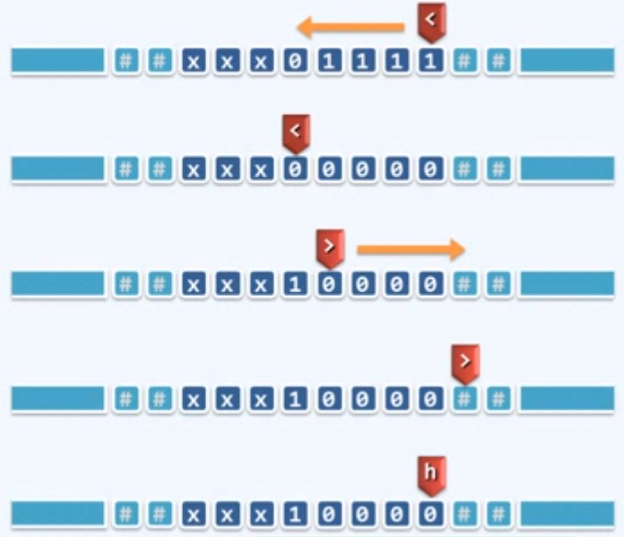

### 计算模型

为给出客观的评判，需要抽象出一个理想的平台或模型，不再依赖种种具体因素，从而直接而准确的描述，测量并评价算法

 ### Turing Machine (图灵机模型)

- Tape：依次均匀地划分为单元格，各注有某一字符，默认为 '#'

- Alphabet：有限的字符种类

- Head：总是对准某一单元格，并可读取和改写其中的字符，每经过一个节拍，可转向左侧或右侧的邻格

- State：TM 总是处于有限种状态中的某一种，每经过一个节拍，可（按照规则）转向另一种状态

- Transition Function：(q, c; d, L/R, p)

  若当前状态为  q 且当前字符为 c，则将当前字符改写为 d；转向左侧/右侧的邻格；转入 p 状态，一旦转入待定的状态 'h' ，则停机

#### 将二进制非负整数加 1

算法：全 '1' 的后缀翻转为全 '0'，原最低位的 '0' 或 '#' 翻转为 '1'

- (<, 1, 0, L, <) // 左行， 1->0
- (<, 0, 1, R, >) // 掉头， 0->1
- (<, #, 1, R, >) // ?
- (>, 0, 0, R, >) // 右行
- (>, #, #, L, h) // 复位 （规范）

### Random Access Machine (RAM 模型)

#### 向下取整除法 Floor

c >= 0, d > 0

[c / d] = max { x | d.x <= c} / max {d.x < 1 + c}

算法分析：

反复地从 R[0] = 1 + c 中减去 R[1] = d， 统计在下溢之前，所做减法的次数x

0. R[3] <- 1 			// increment
1. R[0] <- R[0] + R[3]         // c++
2. R[0] <- R[0] - R[1]          // c -= d
3. R[2] <- R[2] + R[3]         // x++
4. IF R[0] > 0 GOTO 2        // if c>0 goto 2
5. R[0] <- R[2] - R[3]           // else x-- and
6. STOP                               //return R[0] = x = [c/d]

