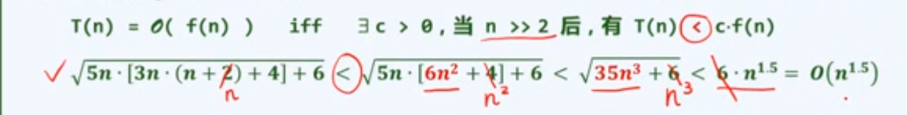
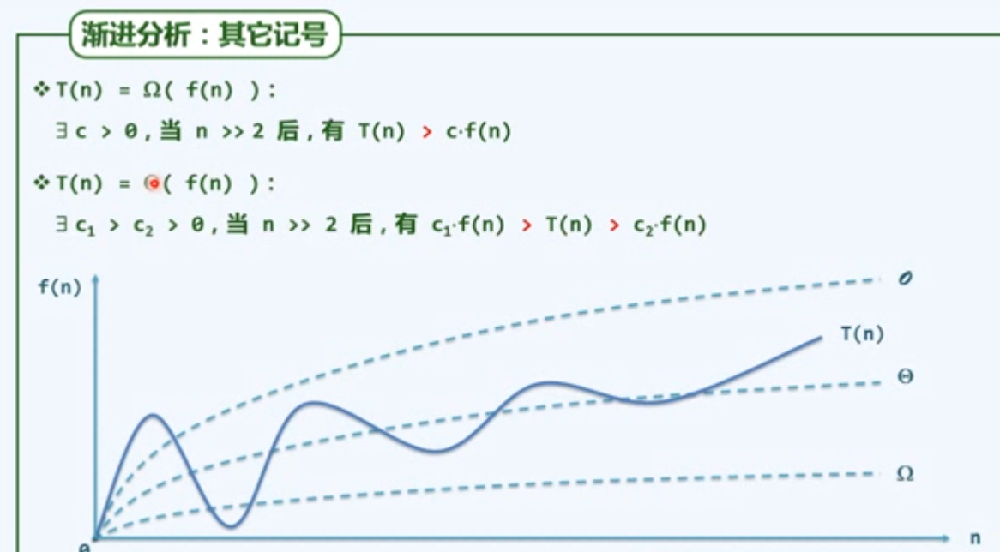
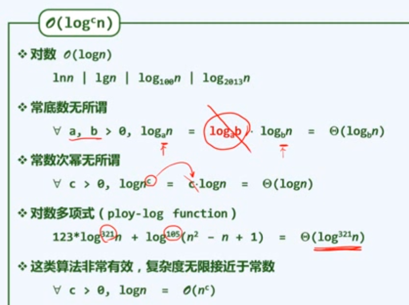
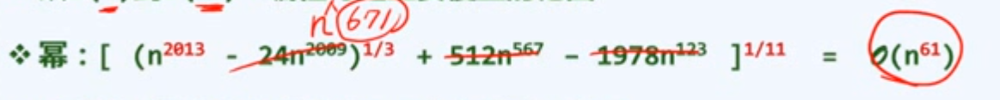
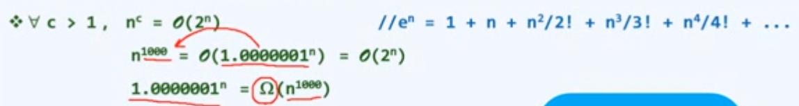
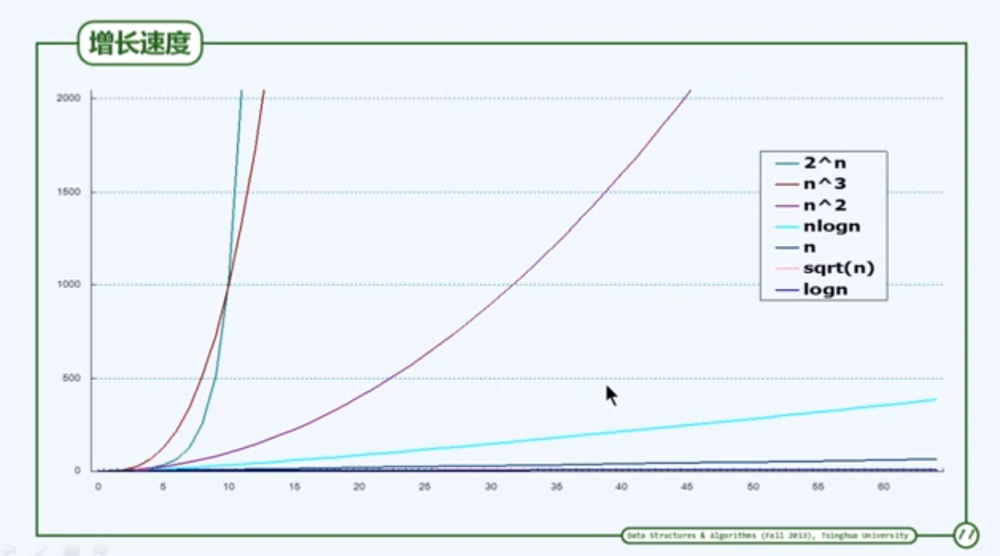

### 大 O 记号 （big-O notation）

- 常系数可忽略：O(f(n)) = O(c x f(n))
- 低次项可忽略：O(na + nb) = O(na) a > b > 0

### 其他记号

大 O 悲观， 大 Ω 乐观

#### 常数复杂度 O(1)

2 / 2013 / 2013 x 2013 / 20132013 = O(1) 		// 含 RAM 各基本操作

#### 对数多项式复杂度 O(logc*n*)

对数 O(log*n*)

ln*n* | lg*n* | log100*n* | log2013*n* 

- 常底数无所谓，可以忽略
- 常数次幂无所谓

对数多项式 （ploy-log function）

**对数多项式复杂度，无限接近于常数复杂度**

#### 多项式复杂度 O(nc)

##### 线性（linear function）：所有 O(n) 类函数

#### 指数复杂度 O(2n)

指数 (exponential function) : T(n) = an

这类算法的计算成本增长极快，通常被认为不可忍受

增长速度

