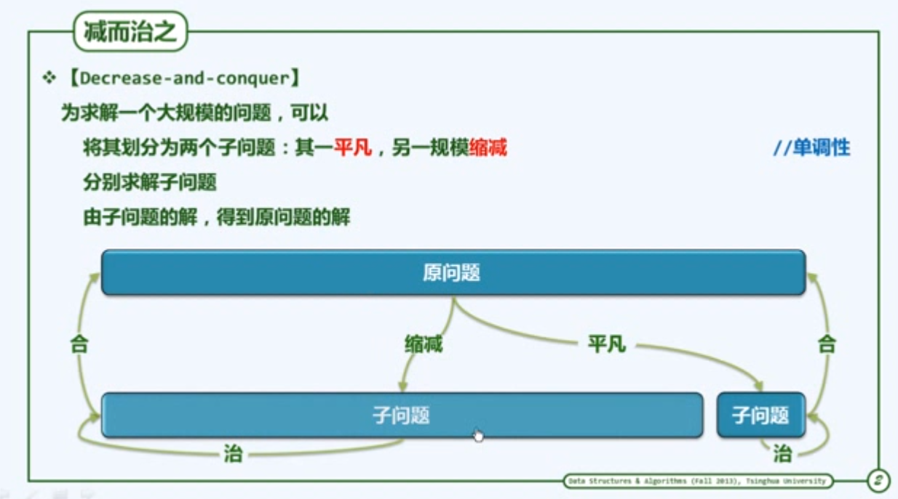

#### 递归跟踪 (recursion trace) 分析

检查每一个递归实例，累计所需时间（调用语言本身，计入对应的子实力）

其总和即算法执行时间

---

#### 递推式分析

从递推角度来看求解数组求和```sum(A, n)```的问题

- 递归求解的规模为 n - 1 的问题 ```sum(A, n - 1)``` 	// T(n-1)
- 再累加上 A[n - 1]     //O(1)

递归基：```sum(A, 0)```     //O(1)

递推方程：

​	T(n) = T(n - 1) + O(1)	//recurrence

​	T(0) = O(1)			//base

求解：

​	T(n) - n = T(n-1) - (n - 1) = ...

​		     = T(2) - 2

​		     = T(1) - 1

​		     = T(0)

​	T(n) = O(1) + n = O(n)


#### 减而治之（Decrease-and-conquer）




#### 分而治之（Divide-and-conquer）


